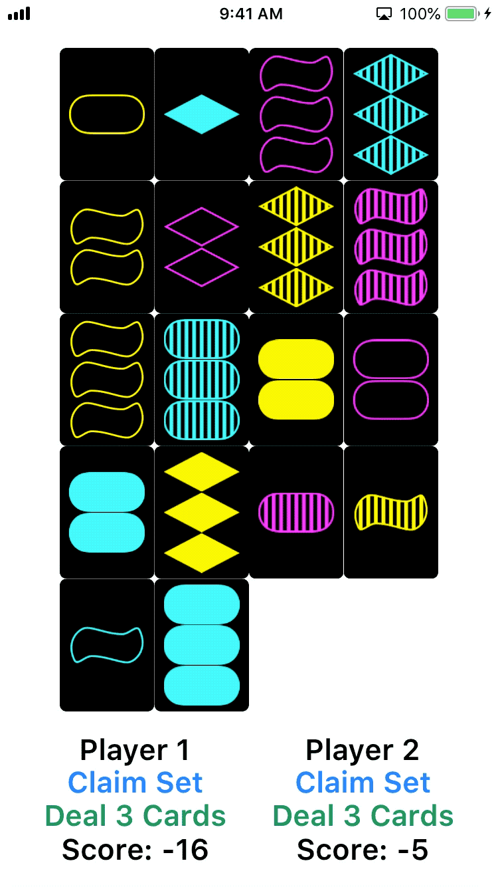

# Stanford iOS Projects

[Assignment PDFs](https://drive.google.com/drive/folders/1-TWZDChwwzkiGzt78QlPZDzN-j82JfR6)

All projects built using Swift 4.1, targeting iOS 11.4.

## Foreword

These assignments are not graded or reviewed.

I encourage any future students to attempt to solve the assignments for a few days before referencing other public solutions. I also recommend comparing several different solutions to find one that helps find a solution to the problem.

## Contributing

I welcome any Issues or Pull Requests to improve this repository! I am not an iOS expert.

## Concentration Game

### :movie_camera: Demo

	

### :heavy_plus_sign: Additional Features

- Time-based bonus scoring, which awards anywhere from 0 points (10+ seconds after last match) to 10 points (<1 after last match)
- True-to-life 3.5:2.5 aspect ratio for cards
- Support for landscape orientation (cards will rotate to fit on screen)

### :bulb: Challenges & Key Takeaways

Overall, this assignment wasn't too challenging because the bulk of the architecture was built almost entirely during the lectures.

## Set Game

### :movie_camera: Demo

	

### :heavy_plus_sign: Additional Features

- Uses a [Swift language version build configuration](https://github.com/apple/swift-evolution/blob/master/proposals/0020-if-swift-version.md) statement to swap the `shuffle()` implementation for the Swift 4.2 implementation, depending on the Swift version
- Uses `NSAttributedString` with `UIControlState.disabled` to change the text color of the **Deal 3 Cards** button when no more cards can be dealt
- Shows label for the number of cards remaining in the deck
- Provides a **HINT** button and match-finding algorithm to help the player find matching sets
- Uses Apple's official font, [San Francisco](https://developer.apple.com/fonts/)

### :bulb: Challenges & Key Takeaways

This assignment was a big (and admittedly frustrating) leap from the first one. Not only is this project built from scratch, but the game logic itself is more involved than Concentration. The assignment documentation reflects this large scope: 16 required tasks + 23 implementation hints. I'm far from happy with the cleanliness of my code for this project, but the end-user experience does look and feel good with the exception of removing cards at the end of the game.

## Graphical Set Game

### :movie_camera: Demo

	

### :heavy_plus_sign: Additional Features

- Used [Metatype](https://docs.swift.org/swift-book/ReferenceManual/Types.html#grammar_metatype-type) to draw the correct symbol on a given card

### :bulb: Challenges & Key Takeaways

This assignment took me a long time because a full View layer refactor makes it difficult to keep a short feedback loop on changes. This resulted in significant refactoring once I "finished" the View layer and resolved all the startup crash bugs.

