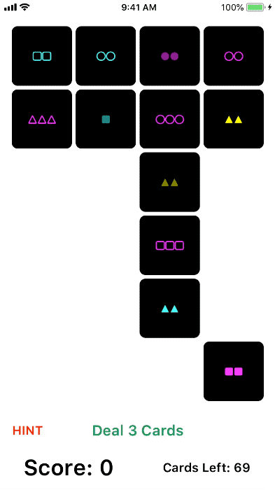

# Stanford iOS Projects

[Assignment PDFs](https://drive.google.com/drive/folders/1-TWZDChwwzkiGzt78QlPZDzN-j82JfR6)

All projects built using Swift 4.1, targeting iOS 11.4.

## Foreword

This repository exists for a few reasons:

1. Track my personal progression
1. Provide a public solution for these public assignments

These assignments are not graded or reviewed. While all core requirements are met for each assignment, not all bonus tasks are complete. Furthermore, some additional features outside the specification are implemented for learning purposes.

To anyone completing the assignments: I encourage you to attempt to solve the assignments for a few days before referencing other public solutions. If you do get stuck, I recommend comparing several different solutions to find one that helps you complete your solution to the problem. Free from the constraints and pressure of a grading system, learning and staying motivated should be the top priorities.

## Concentration Game

### Demo

	

### :heavy_plus_sign: Additional Features

- 6 available (hardcoded) themes: halloween, christmas, people, animals, countries, and tech
- Time-based bonus scoring, which awards anywhere from 0 points (10+ seconds after last match) to 10 points (<1 after last match)
- True-to-life 3.5:2.5 aspect ratio for cards
- Support for landscape orientation (cards will rotate to fit on screen)
- Several `extension` are implemented for ease-of-use
- [`assert`](https://developer.apple.com/documentation/swift/1541112-assert) used for debugging input arguments

### :bulb: Challenges & Key Takeaways

Overall, this assignment wasn't too challenging because the bulk of the architecture was built almost entirely during the lectures.

- Understanding Optionals is a unique and challenging concept. Thankfully, this project didn't rely on them too much.
- Getting accustomed to argument & parameter labels is odd, but not an unwelcome language feature.
- The `Collection` protocol makes working with `Array`, `Dictionary`, and other data structures easier than other object-oriented languages.
- Surprisingly, the `--` and `++` operators were [removed in Swift 3](https://github.com/apple/swift-evolution/blob/master/proposals/0004-remove-pre-post-inc-decrement.md). Weird, but I don't disagree with the thorough justification.
- Markdown documentation comments are great for both readability and knowledge transfer.
- `extension` is a very useful tool for organizing code and isolating scary algorithms.

## Set Game

### Demo

	

### :heavy_plus_sign: Additional Features

- Uses a [Swift language version build configuration](https://github.com/apple/swift-evolution/blob/master/proposals/0020-if-swift-version.md) statement to swap the `shuffle()` implementation for the Swift 4.2 implementation, depending on the Swift version
- Minor implementations of error-handling
- Uses `NSAttributedString` with `UIControlState.disabled` to change the text color of the **Deal 3 Cards** button when no more cards can be dealt
- Adds label to show the number of cards remaining in the deck
- Provides a **HINT** button and match-finding algorithm to help the player find matching sets
- Uses Apple's official font, [San Francisco](https://developer.apple.com/fonts/)

### :bulb: Challenges & Key Takeaways

This assignment was a big (and admittedly frustrating) leap from the first one. Not only is this project built from scratch, but the game logic itself is more involved than Concentration. The assignment documentation reflects this large scope: 16 required tasks + 23 implementation hints. I'm far from happy with the cleanliness of my code for this project, but the end-user experience does look and feel good with the exception of removing cards at the end of the game.

- Several features only available in Swift 4.2 would've been useful: [`CaseIterable`](https://github.com/apple/swift-evolution/blob/master/proposals/0194-derived-collection-of-enum-cases.md) and [`Sequence.shuffle()`](https://github.com/apple/swift-evolution/blob/master/proposals/0202-random-unification.md).
- Building the `NSAttributedString` text was difficult to do cleanly since it had dependencies on the other attributes of `Card`.
- Keeping sync between the Model and View was difficult because the only correlation between the `UIButton` and the corresponding `Card` was the index. This was complicated by the [`remove(at:)`](https://developer.apple.com/documentation/swift/array/1641390-remove) function, which moves Elements up in the `Array`. Ideally, this architecture should be improved.
- The rules of the game itself were not easy to comprehend. Difficult requirements make for difficult business logic.

## Graphical Set Game

### Demo

### :heavy_plus_sign: Additional Features

- Used [Metatype](https://docs.swift.org/swift-book/ReferenceManual/Types.html#grammar_metatype-type) to draw the correct symbol on a given card

### :bulb: Challenges & Key Takeaways

- Drawing with `UIBezierPath` can get messy quickly. Conversely, the simplicity of the tool is very approachable.

